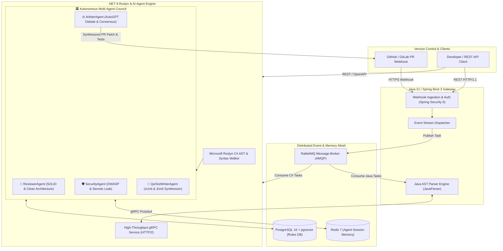

# 🏛️ Autonomous Code Architect & Refactoring Engine
### *AI-Powered Multi-Agent Code Review, Compiler-Level AST Analysis & Automated Test Synthesizer*

[](https://dotnet.microsoft.com/)
[](https://openjdk.org/)
[](https://spring.io/projects/spring-boot)
[](https://grpc.io/)
[](https://www.docker.com/)
[](https://www.rabbitmq.com/)
[](https://github.com/pgvector/pgvector)
[](https://xunit.net/)
[](https://opensource.org/licenses/MIT)

---

## 📌 Overview

**Autonomous Code Architect** is an enterprise-grade, distributed static analysis and autonomous multi-agent code remediation platform. It merges the high-performance compiler infrastructure of **.NET 9 (Microsoft Roslyn)** with the asynchronous event-driven capabilities of **Java 21 & Spring Boot 3**.

Unlike standard LLM code wrappers, this system operates on a **Hybrid Graceful Degradation Architecture**:
1. **Deterministic Compiler AST Engine (Zero AI Cost / Sub-100ms Latency):** Extracts Syntax Trees, Computes Cyclomatic Complexity (CC), and identifies Clean Architecture and OWASP security violations with line-level accuracy deterministically.
2. **Autonomous Multi-Agent Debate Council (AutoGPT-style Consensus):** A council of specialized AI agents analyzes the deterministic findings, challenges each other's opinions in an automated debate loop, resolves conflicts, and generates executable unit tests (**xUnit** / **JUnit 5**) and refactoring patches.

---

## 🏗️ High-Level System Architecture



---

## 🤖 The Autonomous Multi-Agent Council (Debate Loop)

When a pull request or code snippet is submitted, the system activates a council of specialized AI agents that review findings and resolve trade-offs:

```
                  ┌─────────────────────────────────────┐
                  │      Deterministic AST Findings     │
                  │ (Violations, Complexity, Line Span) │
                  └──────────────────┬──────────────────┘
                                     │
                 ┌───────────────────┼───────────────────┐
                 ▼                   ▼                   ▼
    ┌─────────────────────────┐┌───────────┐┌─────────────────────────┐
    │     ReviewerAgent       ││  Security ││    QaTestWriterAgent    │
    │  (Clean Code / SOLID)   ││   Agent   ││  (xUnit/JUnit Synthesis)│
    └────────────┬────────────┘└─────┬─────┘└────────────┬────────────┘
                 │                   │                   │
                 └───────────────────┼───────────────────┘
                                     ▼
                    ┌─────────────────────────────────┐
                    │      ArbiterAgent (Hakem)       │
                    │   • Resolves Agent Conflicts    │
                    │   • Synthesizes Unit Tests      │
                    │   • Produces Final Verdict & PR │
                    └─────────────────────────────────┘
```

| Agent Name | Specialty | Decision Policy |
| :--- | :--- | :--- |
| **🧐 ReviewerAgent** | Architecture, SOLID, Clean Code | Requests changes if Cyclomatic Complexity > 8 or SRP is violated. |
| **🛡️ SecurityAgent** | OWASP Top 10, Secrets, CVEs | **Veto Authority:** Blocks merge if hardcoded secrets or critical vulnerabilities exist. |
| **🧪 QaTestWriterAgent** | Automated Test Engineering | Automatically synthesizes target-specific unit tests (**xUnit** for C#, **JUnit 5** for Java). |
| **⚖️ ArbiterAgent** | Debate Arbiter & Consensus | Mediates conflicting agent opinions into a single actionable PR verdict and Git patch. |

---

## ⚡ Active Compiler Rules (Deterministic Engine)

| Rule ID | Name | Category | Severity | Description |
| :--- | :--- | :--- | :--- | :--- |
| `ARCH-CS-001` | `AvoidAsyncVoidMethods` | Code Smell | **CRITICAL** | Detects `async void` methods that can crash the runtime on unhandled exceptions. |
| `ARCH-CS-002` | `AvoidEmptyCatchBlocks` | Code Smell | **WARNING** | Detects empty catch blocks that silently swallow exceptions. |
| `ARCH-CS-003` | `AvoidLargeMethods` | SOLID / SRP | **WARNING** | Flags methods exceeding 30 lines of code violating Single Responsibility. |
| `ARCH-SEC-001`| `HardcodedSecretDetected`| Security / OWASP | **CRITICAL** | Detects hardcoded API keys, passwords, and tokens in source code. |
| `ARCH-CA-001` | `DomainLayerViolation` | Clean Architecture | **ERROR** | Enforces DDD boundaries: flags Domain layer importing Infrastructure/Web. |
| `ARCH-JAVA-001`| `AvoidEmptyCatchBlocks`| Code Smell (Java) | **WARNING** | Detects silent failure blocks in Java source code. |
| `ARCH-JAVA-003`| `TooManyParameters` | Code Smell (Java) | **WARNING** | Flags methods accepting more than 4 parameters. |
| `ARCH-JAVA-004`| `AvoidSystemOutPrintln` | Logging Standard | **INFO** | Recommends SLF4J / Logback instead of `System.out.println`. |

---

## 📁 Repository Structure

```text
autonomous-code-architect/
├── deploy/
│   ├── docker-compose.yml             # Full-stack orchestrator (.NET + Java + Infra)
│   ├── docker-compose.infra.yml       # Standalone Infrastructure (Postgres, Redis, RabbitMQ)
│   ├── init-scripts/
│   │   └── 01-init-pgvector.sql       # Vector database schema initialization
│   ├── samples/                       # Test benchmark source files
│   └── test-analyze.ps1               # Automated end-to-end testing script
│
├── services/
│   ├── dotnet-agent-engine/           # [.NET 9 / C# Engine]
│   │   ├── src/
│   │   │   ├── Architect.Contracts/   # Protobuf generated gRPC contracts
│   │   │   ├── Architect.Core/        # Domain Models & Interfaces
│   │   │   ├── Architect.Application/ # CQRS (MediatR), DTOs & Use Cases
│   │   │   ├── Architect.RoslynParser/# Roslyn AST Syntax Tree & Rules Engine
│   │   │   ├── Architect.Agents/      # AutoGPT Multi-Agent Debate & Arbiter Engine
│   │   │   ├── Architect.Infrastructure/# Postgres, Redis & RabbitMQ clients
│   │   │   └── Architect.GrpcService/ # ASP.NET Core & gRPC server
│   │   ├── tests/
│   │   │   └── Architect.RoslynParser.Tests/ # xUnit unit test suite
│   │   ├── ArchitectEngine.sln
│   │   └── Dockerfile
│   │
│   └── java-gateway-analyzer/         # [Java 21 / Spring Boot 3 Service]
│       ├── src/main/java/com/architect/gateway/
│       │   ├── analyzer/              # JavaParser AST Static Analyzer
│       │   ├── config/                # Spring Security 6 & RabbitMQ setup
│       │   ├── controller/            # GitHub Webhooks & REST Endpoints
│       │   └── dto/                   # Request/Response Data Transfer Objects
│       ├── src/test/java/             # JUnit 5 & Mockito test suite
│       ├── pom.xml
│       └── Dockerfile
│
└── shared/
    └── protos/
        └── code_analysis.proto        # Cross-language Protocol Buffer contract
```

---

## 🚀 Getting Started

### Prerequisites
* [Docker Desktop](https://www.docker.com/) (Version 25+ with Docker Compose v2)
* [.NET 9 SDK](https://dotnet.microsoft.com/download/dotnet/9.0) (For local .NET development)
* [Java 21 / OpenJDK](https://openjdk.org/) & [Maven 3.9+](https://maven.apache.org/) (For local Java development)

### 1. Launch Infrastructure with Docker Compose
```bash
cd autonomous-code-architect/deploy
docker compose -f docker-compose.infra.yml up -d
```
* **PostgreSQL (pgvector):** `localhost:5432`
* **Redis:** `localhost:6379`
* **RabbitMQ Management UI:** `http://localhost:15672` *(User: `architect_rabbit`, Pass: `architect_rabbit_pass`)*

---

### 2. Run .NET Engine Locally
```bash
cd services/dotnet-agent-engine
dotnet build ArchitectEngine.sln
dotnet test
dotnet run --project src/Architect.GrpcService
```
* **REST API & Swagger:** `http://localhost:5000`
* **gRPC Endpoint:** `localhost:5001`

---

### 3. Run Java Spring Boot Gateway Locally
```bash
cd services/java-gateway-analyzer
mvn clean test
mvn spring-boot:run
```
* **Webhook & REST Gateway:** `http://localhost:8080`

---

## 🧪 Live API Verification

### 1. Deterministic AST Analysis (No AI / Sub-100ms)
```bash
curl -X POST http://localhost:5000/api/v1/analyze \
  -H "Content-Type: application/json" \
  -d '{
    "filePath": "src/Domain/Orders/OrderService.cs",
    "sourceCode": "namespace MyCompany.Domain.Orders;\nusing Microsoft.AspNetCore.Mvc;\npublic class OrderService {\n    private string dbApiKey = \"sk_live_123456\";\n    public async void Run() {}\n}",
    "language": "CSHARP"
  }'
```

**Response Output:**
```json
{
  "requestId": "req-live-100",
  "success": true,
  "metrics": {
    "linesOfCode": 6,
    "cyclomaticComplexity": 1,
    "maintainabilityIndex": 98
  },
  "violations": [
    {
      "ruleId": "ARCH-CS-001",
      "ruleName": "AvoidAsyncVoidMethods",
      "severity": 4,
      "suggestedFix": "'async void Run' yerine 'async Task Run' kullanın."
    },
    {
      "ruleId": "ARCH-SEC-001",
      "ruleName": "HardcodedSecretDetected",
      "severity": 4,
      "suggestedFix": "Gizli değerleri kaynak kodda tutmayın. 'IConfiguration' veya Key Vault kullanın."
    },
    {
      "ruleId": "ARCH-CA-001",
      "ruleName": "DomainLayerDependencyViolation",
      "severity": 3,
      "suggestedFix": "Domain içinde Interface tanımlayın ve Dependency Inversion uygulayın."
    }
  ],
  "executionTimeMs": 85
}
```

---

### 2. Autonomous Multi-Agent Debate (AutoGPT Mode)
```bash
curl -X POST http://localhost:5000/api/v1/debate \
  -H "Content-Type: application/json" \
  -d '{
    "filePath": "src/Domain/Orders/OrderService.cs",
    "sourceCode": "namespace MyCompany.Domain.Orders;\nusing Microsoft.AspNetCore.Mvc;\npublic class OrderService {\n    private string dbApiKey = \"sk_live_123456\";\n    public async void Run() {}\n}",
    "language": "CSHARP"
  }'
```

---

## 🛡️ License

This project is licensed under the **MIT License** - see the [LICENSE](LICENSE) file for details.
